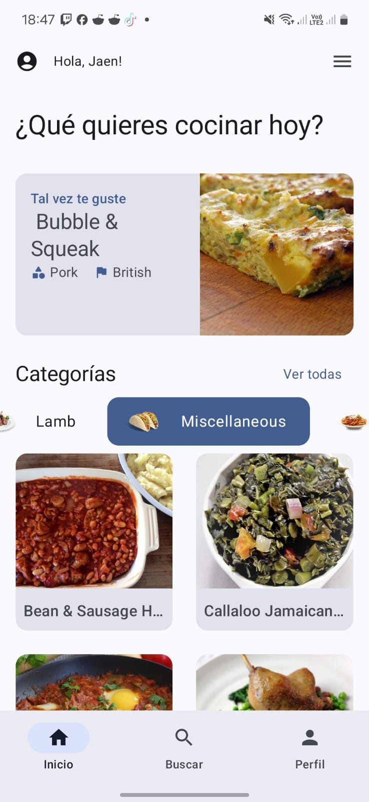
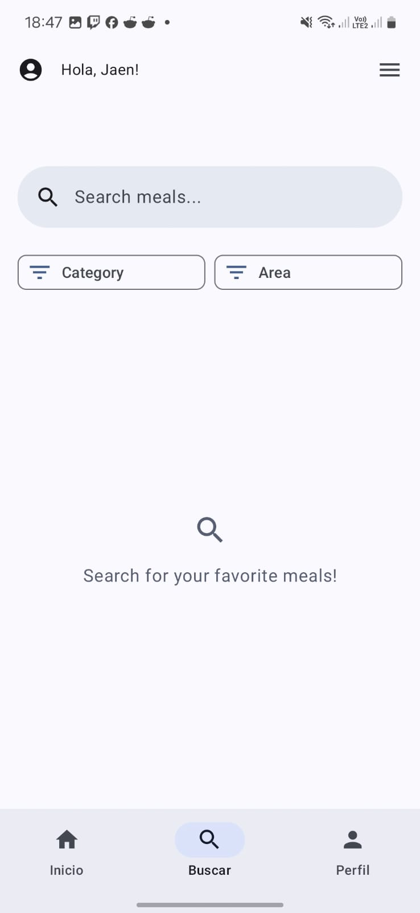
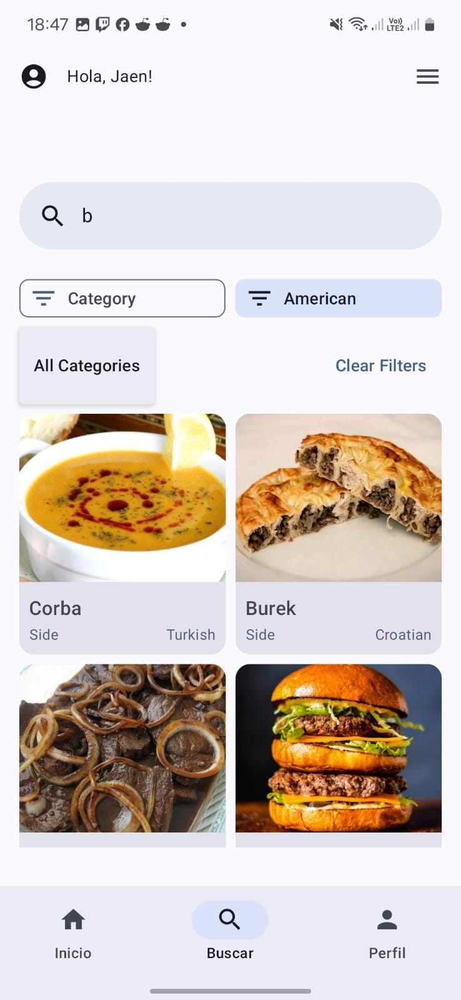

# RecipeBuddy

**RecipeBuddy** es una aplicación Android de código abierto desarrollada en Kotlin que permite a los usuarios gestionar y organizar sus recetas de manera intuitiva. La aplicación utiliza Jetpack Compose para construir interfaces de usuario modernas, Retrofit para la comunicación con APIs de recetas, y se apoya en una arquitectura robusta que separa la lógica de negocio de la presentación.

## Tabla de Contenidos

- [Características](#características)
- [Arquitectura y Componentes](#arquitectura-y-componentes)
- [Instalación](#instalación)
- [Uso de la Aplicación](#uso-de-la-aplicación)
- [Visual: Cómo se Ve y Cómo se Usa](#visual-cómo-se-ve-y-cómo-se-usa)
- [Contribuciones](#contribuciones)
- [Licencia](#licencia)

---

## Características

- **Búsqueda de Recetas:** Permite buscar recetas por nombre o ingredientes.
- **Navegación Intuitiva:** Utiliza pantallas como Home, Detalle, Perfil y Búsqueda para una experiencia fluida.
- **Manejo de Estados:** Implementa UIStates para gestionar los estados de carga, éxito y error.
- **Interfaz Moderna:** Desarrollada con Jetpack Compose, la UI se adapta a diferentes tamaños y soporta temas claros/oscuros.
- **Receta Aleatoria y Categorías:** Descubre recetas aleatoriamente y explora por categorías y áreas geográficas.
- **Optimización de Recursos:** Uso de imágenes en formato WebP que optimizan la carga del recurso, asegurando una experiencia rápida y de calidad.

---

## Arquitectura y Componentes

La aplicación sigue buenas prácticas de arquitectura en Android dividiendo el código en capas y módulos:

- **Data Layer:**  
  - Modelos (ej. `Meal.kt`) que definen la estructura de cada receta.
  - Servicios de API (usando Retrofit) para obtener datos de recetas externas.

- **UI Layer:**  
  - **HomeScreen:** Muestra una vista inicial con secciones para receta aleatoria, categorías y listado filtrado.
  - **DetailScreen:** Presenta los detalles completos de una receta con manejo de estados (loading, error, éxito).
  - **ProfileScreen:** Visualiza la información del usuario y recetas guardadas.
  - **SearchScreen:** Proporciona el buscador de recetas y la navegación al detalle de cada receta.

- **Componentes Comunes:**  
  - *TopAppBar* y *BottomNavigation* para una navegación consistente.
  - Componentes multiplicados (como `ErrorMessage`, `RandomFoodCard`, `RecipeSearch`) para reutilizar lógica y estilos.

---

## Instalación

1. **Clonar el Repositorio:**  
   Ejecuta el siguiente comando en la terminal:
   ```bash
   git clone https://github.com/KotlinAndroidProjects/RecipeBuddy.git
   ```

2. **Abrir en Android Studio:**  
   - Importa el proyecto en Android Studio.
   - Asegúrate de tener instalados el SDK y las dependencias necesarias.

3. **Compilar y Ejecutar:**  
   - Selecciona un dispositivo físico o un emulador.
   - Compila y ejecuta la aplicación para comenzar a probar sus funcionalidades.

---

## Uso de la Aplicación

1. **Inicio de la App:**  
   Al iniciar RecipeBuddy, se despliega la pantalla principal (HomeScreen) donde podrás:
   - Ver una receta aleatoria en la parte superior.
   - Explorar recetas por categoría y área.
   - Acceder a la barra de búsqueda para filtrar recetas por nombre o ingrediente.

2. **Navegación entre Pantallas:**  
   - **HomeScreen:** Explora recetas, accede a la información de categorías y selecciona una receta para ver sus detalles.
   - **DetailScreen:** Visualiza datos completos de la receta seleccionada, incluidas instrucciones, ingredientes y multimedia (ej. videos de YouTube).
   - **SearchScreen:** Realiza búsquedas rápidas y navega al detalle de la receta de tu elección.
   - **ProfileScreen:** Consulta tu perfil y las recetas que has guardado para un acceso rápido en futuras sesiones.

3. **Manejo de Estados:**  
   La aplicación gestiona estados de carga y errores de forma fluida, mostrando indicadores de progreso y mensajes de error cuando sea necesario para mantener una experiencia de uso sin contratiempos.

---

## Visual: Cómo se Ve y Cómo se Usa

Para proporcionar una mejor comprensión visual, a continuación se muestran ejemplos de cómo se ve la aplicación y cómo se usa:

### Ejemplo de Imagen: Pantalla Principal

Asegúrate de que la imagen se encuentre en la ruta correcta dentro del repositorio (por ejemplo, `assets/images/home_screen.png`).



### Ejemplo de Imagen: Busqueda de Recetas

Una captura de pantalla que muestre la vista de detalle de una receta, en la que se puede ver la información completa, ingredientes e instrucciones.



### Ejemplo de Imagen: Filtro de Recetas

Una captura de pantalla que muestre la vista de detalle de una receta, en la que se puede ver la información completa, ingredientes e instrucciones.




### Ejemplo de Video: Demostración de la App

Para un recorrido dinámico de la aplicación, puedes incluir un enlace a un video de demostración:
[Video de Demostración de RecipeBuddy](assets/videoApp.mp4)

> **Consejo:** Organiza las imágenes y videos dentro de la carpeta `assets` del proyecto para mantener el repositorio limpio y fácil de mantener.

---

## Contribuciones

¡Las contribuciones son bienvenidas! Para colaborar en el proyecto, sigue estos pasos:

1. Realiza un fork del repositorio.
2. Crea una rama con un nombre descriptivo para la funcionalidad o corrección de errores.
3. Realiza tus cambios y envía un pull request detallando las modificaciones y el motivo.
4. Para cambios importantes, discútelos previamente abriendo un issue.
